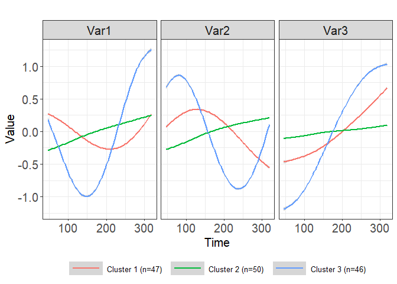

<!-- README.md is generated from README.Rmd. Please edit that file -->

# TPSClus

<!-- badges: start -->
<!-- badges: end -->

`TPSClus` is an R package designed to implement fuzzy clustering of
multivariate longitudinal data using tensor product smoothing splines.
The `TPSfit()` function fits the splines to three or more variables that
are measured repeatedly over time. The `cluster.fitted()` or
`cluster.coefs()` functions can then be used to identify fuzzy clusters
in the data. Lastly, the `FKM.glm()` function can be used to generate a
generalized linear model for a distal outcome using the fuzzy clusters
and other covariates as predictors. A number of plot options are
available for visualization of the data and clusters.

## Installation

You can install the development version of TPSClus like so (need to
update):

``` r
devtools::install_github("silivingston/TPSClus", dependencies = TRUE, build_vignettes = TRUE)
```

## Example

Basic example of flow using built-in simulated dataset:

Fit splines to multivariate data:

``` r
library(TPSClus)
data(TS.sim)

fitsplines2 <- TPSfit(TS.sim, vars=c("Var1", "Var2", "Var3"),
time="Time", ID="SubjectID", knots_time=c(0, 91, 182, 273, 365),
     fit_times=c(46, 91, 137, 182, 228, 273, 319))
```

Run fuzzy clustering algorithm on the smoothed data using 3 clusters:

``` r
clusters1 <- cluster.fitted(fitsplines2, k=3, m=1.3, seed=12345, RS=5, noise=TRUE)
summary(clusters1)
#> cluster.fitted(TPSdata = fitsplines2, k = 3, m = 1.3, noise = TRUE, 
#>     seed = 12345, RS = 5)
#> 
#> 150 subjects clustered into 3 clusters + noise cluster using m = 1.3 
#> Clusters based on fitted values at times 46 91 137 182 228 273 319 
#> and slopes between points
#> 
#> Cluster summary:
#>       Cl.size Min.degree Max.degree Mean.degree
#> Clus1      47      0.489          1       0.983
#> Clus2      50      0.483          1       0.980
#> Clus3      46      0.862          1       0.991
#> Noise       7      0.933          1       0.980
#> 
#> Component 'FKM_TPS' contains the fuzzy clustering details from package 'fclust'.
#> Components of 'FKM_TPS':
#>  [1] "U"         "H"         "F"         "clus"      "medoid"    "value"    
#>  [7] "criterion" "iter"      "k"         "m"         "ent"       "b"        
#> [13] "vp"        "delta"     "stand"     "Xca"       "X"         "D"        
#> [19] "call"     
#> 
#> Cluster validity indices:
#>         PC         PE        MPC        SIL      SIL.F         XB 
#> 0.92979979 0.04137373 0.89469968 0.46242525 0.48364829 0.24117979 
#> 
#> Output dataset 'FKM_TPS_U' contains degree of cluster membership and modal
#>       cluster assignment for each object.
#> Head of dataset 'FKM_TPS_U':
#>   Id2 SubjectID        Clus1        Clus2        Clus3        Noise ClusModal
#> 1   1        17 1.309679e-05 0.9999862733 8.929241e-08 5.406552e-07         2
#> 2   2        19 9.665821e-04 0.0004435711 9.972477e-01 1.342137e-03         3
#> 3   3        34 4.719129e-06 0.9999952117 1.255723e-08 5.657849e-08         2
#> 4   4        52 1.188519e-05 0.9999878294 4.352554e-08 2.418527e-07         2
#> 5   5        55 6.427492e-04 0.0003088823 9.982691e-01 7.792961e-04         3
#> 6   6        83 3.651509e-03 0.0012300893 9.802217e-01 1.489672e-02         3
```

Plot the mean cluster trajectories:

``` r
plot(clusters1, legend_label_size=10)
#> `geom_smooth()` using method = 'gam' and formula 'y ~ s(x, bs = "cs")'
```



Fit a GLM using the clusters and other covariates as predictors:

``` r
model <- FKM.glm(clusters1, TS.sim, y="outcome", covariates=c("x1", "x2"),
family="binomial")
summary(model)
#> Full model:
#> Formula (f1):  outcome ~ Clus2 + Clus3 + Noise + x1 + x2 
#> Family: binomial 
#> 
#> Call:
#> glm(formula = f1, family = family, data = data3)
#> 
#> Deviance Residuals: 
#>      Min        1Q    Median        3Q       Max  
#> -1.97164  -0.22557  -0.02179   0.13942   2.11563  
#> 
#> Coefficients:
#>             Estimate Std. Error z value Pr(>|z|)    
#> (Intercept) 10.42476    2.11640   4.926 8.41e-07 ***
#> Clus2        1.15006    0.86491   1.330   0.1836    
#> Clus3        2.37069    1.00594   2.357   0.0184 *  
#> Noise        3.52023    1.73903   2.024   0.0429 *  
#> x1           0.73342    0.68421   1.072   0.2838    
#> x2          -0.27902    0.05381  -5.185 2.16e-07 ***
#> ---
#> Signif. codes:  0 '***' 0.001 '**' 0.01 '*' 0.05 '.' 0.1 ' ' 1
#> 
#> (Dispersion parameter for binomial family taken to be 1)
#> 
#>     Null deviance: 201.065  on 149  degrees of freedom
#> Residual deviance:  63.838  on 144  degrees of freedom
#> AIC: 75.838
#> 
#> Number of Fisher Scoring iterations: 7
#> 
#> 
#> ANOVA chi-square p-value for significance of clusters in model:
#> 0.03360065
```

Predict the outcome for a new dataset:

``` r
data(TS.sim.new)
predicted <- predict(model, TS.sim.new)
head(predicted)
#>   SubjectID x1   x2 Id2        Clus1       Clus2        Clus3        Noise
#> 1      1626  0 23.5   1 3.263066e-06 0.999996610 1.915778e-08 1.075745e-07
#> 2      1627  0 87.2   2 1.091953e-02 0.004496758 9.803848e-01 4.198949e-03
#> 3      1629  0 59.3   3 6.915108e-02 0.045432056 8.668493e-01 1.856759e-02
#> 4      1634  0 36.3   4 2.411935e-07 0.999999754 8.120729e-10 3.633010e-09
#> 5      1641  1 49.6   5 2.365786e-01 0.119455660 1.033256e-02 6.336331e-01
#> 6      1650  0 34.1   6 4.438164e-09 0.999999995 1.583192e-11 6.998691e-11
#>   ClusModal    predicted
#> 1         2 9.934247e-01
#> 2         3 9.524077e-06
#> 3         3 1.891861e-02
#> 4         2 8.094402e-01
#> 5         0 4.282913e-01
#> 6         2 8.869764e-01
```

<!-- You'll still need to render `README.Rmd` regularly, to keep `README.md` up-to-date. `devtools::build_readme()` is handy for this. You could also use GitHub Actions to re-render `README.Rmd` every time you push. An example workflow can be found here: <https://github.com/r-lib/actions/tree/v1/examples>. -->
<!-- You can also embed plots, for example: -->
<!-- ```{r pressure, echo = FALSE} -->
<!-- plot(pressure) -->
<!-- ``` -->
<!-- In that case, don't forget to commit and push the resulting figure files, so they display on GitHub and CRAN. -->
